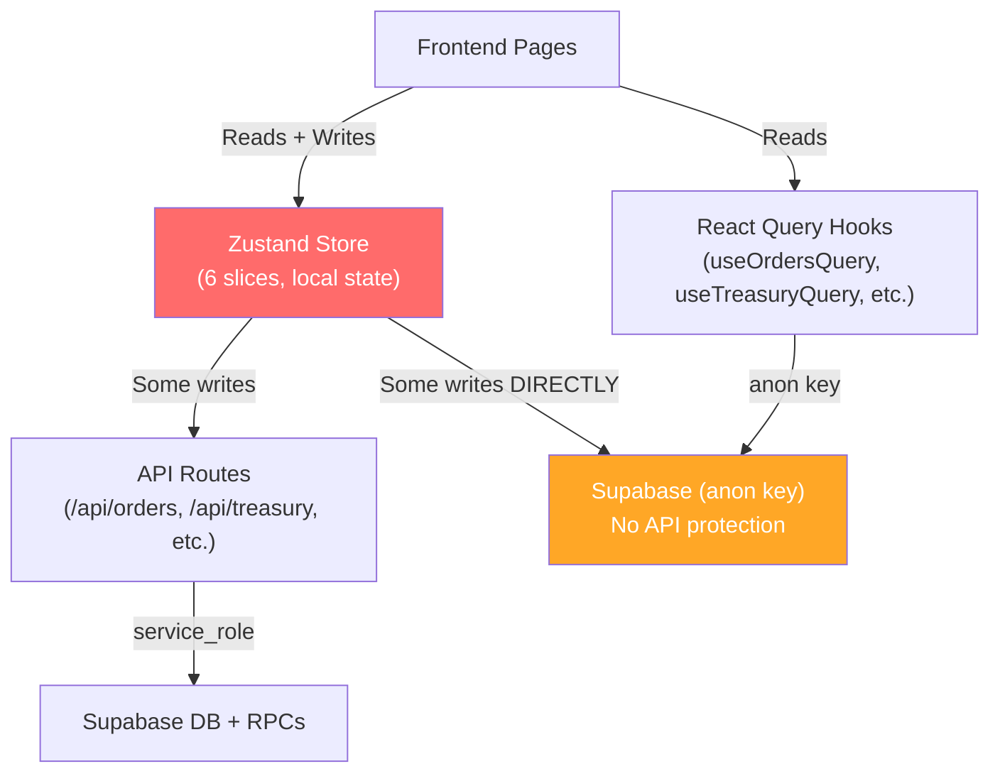

# Bunyan ERP — Comprehensive System Investigation Report

> تقرير الفحص الشامل لنظام Bunyan ERP — تقييم المعمار، الأمان، سلامة البيانات، والاستقرار

---

## 1. Mental Model: How the System ACTUALLY Works

The system is a **multi-tenant SaaS ERP** built with Next.js (App Router) + Supabase, currently in a **transitional hybrid state** between two architectures:



### The Core Contradiction

The system is split between **two incompatible state management paradigms** running simultaneously:

| Layer | Pattern | Source of Truth | Persistence |
|-------|---------|-----------------|-------------|
| **Zustand Slices** | Local-first, optimistic | Client memory | ❌ None — lost on refresh for treasury side-effects |
| **React Query Hooks** | Server-first, fetched | Supabase DB | ✅ Persistent |
| **API Routes** | Server-side mutations | Supabase via service_role | ✅ Persistent |

**Both systems coexist and sometimes conflict.** Components may read from React Query but write through Zustand actions, or read from Zustand but data was written by API routes. The result is a split-brain architecture where **the client's view of reality diverges from the database's actual state**.

---

## 2. All Detected Inconsistencies and Hidden Failure Points

### 🔴 CRITICAL — Financial Data Corruption Risks

#### C1: Ghost Treasury Transactions (Order Status Changes)

[ordersSlice.ts](file:///c:/Users/abdo/Documents/erb/1/libya-erp-saas%202/src/core/db/slices/ordersSlice.ts)

When [updateOrderStatus](file:///c:/Users/abdo/Documents/erb/1/libya-erp-saas%202/src/core/db/slices/ordersSlice.ts#164-395) is called (delivered → cancelled, or return_confirmed), the slice:
1. ✅ Updates order status in Supabase
2. ✅ Calls `restore_inventory` RPC to restore stock in DB
3. ❌ **Creates treasury transactions ONLY in local Zustand state** — never persisted to DB
4. ❌ **Modifies treasury account balances ONLY in local Zustand state** — never persisted to DB

**Impact**: Every order cancellation or return creates phantom financial records that exist only in the browser. On page refresh, these vanish. The treasury balance shown to users can differ from the actual DB balance.

#### C2: Duplicate Treasury API Routes with Conflicting Logic

Two separate API routes exist for treasury:

| Route | Used By | Mechanism |
|-------|---------|-----------|
| [/api/treasury/transaction](file:///c:/Users/abdo/Documents/erb/1/libya-erp-saas%202/src/app/api/treasury/transaction/route.ts) | **Unknown** (possibly dead code) | Non-atomic: INSERT tx → RPC → fallback manual UPDATE |
| [/api/treasury/transactions](file:///c:/Users/abdo/Documents/erb/1/libya-erp-saas%202/src/app/api/treasury/transactions/route.ts) | `coreSlice.addTransaction` | Atomic RPC `create_treasury_transaction_atomic` |

The **old route** (`/api/treasury/transaction`) has a catastrophic fallback at line 53–55:
```typescript
// Fallback: sets balance = t.amount (ABSOLUTE, not incremental)
await supabaseAdmin.from('treasury_accounts')
  .update({ balance: t.amount })
  .eq('id', t.accountId);
```
If the RPC fails and the fallback triggers, the account balance is **overwritten with the transaction amount** instead of being incremented. For example, if balance = 10,000 and a 50 LYD transaction fails RPC, balance becomes 50.

#### C3: Non-Atomic Product Purchase Flow

[/api/products POST](file:///c:/Users/abdo/Documents/erb/1/libya-erp-saas%202/src/app/api/products/route.ts) performs 3 separate, non-transactional operations:
1. INSERT product → 2. INSERT treasury_transaction → 3. RPC increment_balance (with manual fallback)

If step 1 succeeds but step 2 or 3 fails, the product exists in inventory but the cost was never deducted from treasury. This creates a **silent financial hole**.

### 🔴 CRITICAL — Security Vulnerabilities

#### S1: Zero Authentication on API Routes

**None of the 9 API routes verify the user's session or identity.** They all trust the `tenantId` from the request body. Any unauthenticated HTTP request with a valid `tenantId` UUID can:
- Create orders for any tenant
- Modify treasury balances of any tenant
- Delete products from any tenant
- Pay debts of any tenant

The middleware at line 23-29 explicitly **skips all /api routes**:
```typescript
if (pathname.startsWith('/api')) {
  return NextResponse.next(); // No auth check
}
```

#### S2: [createServiceClient](file:///c:/Users/abdo/Documents/erb/1/libya-erp-saas%202/src/core/db/supabase.ts#19-28) Uses Wrong Client Type

[supabase.ts](file:///c:/Users/abdo/Documents/erb/1/libya-erp-saas%202/src/core/db/supabase.ts) line 19–27:
```typescript
export function createServiceClient() {
  // Uses createBrowserClient for server-side operations!
  return createBrowserClient(
    process.env.NEXT_PUBLIC_SUPABASE_URL!,
    process.env.SUPABASE_SERVICE_ROLE_KEY!
  );
}
```
This uses `createBrowserClient` (designed for browser) with the `service_role` key on the server. While it may work functionally, it bypasses Supabase's server-side session management and cookie handling designed for `createServerClient`. Some API routes (orders, products, debts) create their own client correctly with [createClient()](file:///c:/Users/abdo/Documents/erb/1/libya-erp-saas%202/src/core/db/supabase.ts#8-18) from `@supabase/supabase-js`, while others (couriers, settlements, treasury/transactions) use this broken factory.

#### S3: RLS Disabled on Critical Tables

- `public.profiles` — **RLS disabled** but has 7 policies defined (policies are ignored)
- `public.tenants` — **RLS disabled** but has 5 policies defined (policies are ignored)

Any user with the anon key can read/modify ALL profiles and ALL tenants across the system.

#### S4: Overly Permissive Geo Policies

`bunyan_cities`, `bunyan_regions`, `provider_geo_mappings` allow unrestricted INSERT/UPDATE/DELETE to anyone (`USING (true)`).

### 🟠 HIGH — Architectural Contradictions

#### A1: Order Status 'new' vs CHECK Constraint

[/api/orders](file:///c:/Users/abdo/Documents/erb/1/libya-erp-saas%202/src/app/api/orders/route.ts) line 64 sets `status: o.status || 'new'`.

The DB CHECK constraint on `orders.status` allows: `'pending', 'processing', 'ready_to_ship', 'with_courier', 'with_partner', 'delivered', 'cancelled', 'pending_return', 'return_confirmed'`.

**`'new'` is NOT in this list.** If the frontend sends `status: undefined`, the insert will fail with a constraint violation.

#### A2: Dual Data Sources for Same Entity

Components reading from React Query hooks get **fresh DB data**. But Zustand slices also cache the same data. Mutations go through Zustand actions which update local state optimistically. The result:

- [useOrdersQuery](file:///c:/Users/abdo/Documents/erb/1/libya-erp-saas%202/src/core/db/hooks/useOrders.ts#6-37) fetches 300 orders from DB
- [useFetchOrders](file:///c:/Users/abdo/Documents/erb/1/libya-erp-saas%202/src/core/db/hooks.ts#26-27) (Zustand) fetches 200 orders from DB into local `orders[]`
- [deleteCourier](file:///c:/Users/abdo/Documents/erb/1/libya-erp-saas%202/src/core/db/slices/coreSlice.ts#368-391) checks the local Zustand `orders[]` (max 200) — so a courier with active orders beyond the 200th one can be deleted

#### A3: [initializeCloudData](file:///c:/Users/abdo/Documents/erb/1/libya-erp-saas%202/src/core/db/initStore.ts#7-18) is a No-Op

[initStore.ts](file:///c:/Users/abdo/Documents/erb/1/libya-erp-saas%202/src/core/db/initStore.ts) only prints `console.log` messages — it does **nothing**. All actual data loading is scattered across individual page mounts calling [fetchOrders()](file:///c:/Users/abdo/Documents/erb/1/libya-erp-saas%202/src/core/db/slices/ordersSlice.ts#110-136), [fetchTreasury()](file:///c:/Users/abdo/Documents/erb/1/libya-erp-saas%202/src/core/db/slices/coreSlice.ts#241-272), etc.

#### A4: Kill-Switch Checks Local Data Only

[tenant/layout.tsx](file:///c:/Users/abdo/Documents/erb/1/libya-erp-saas%202/src/app/%28tenant%29/layout.tsx) lines 67-99 check `useDataStore.getState().tenants` and `useDataStore.getState().users` every 3 seconds. But these arrays are **never fetched from Supabase** — they only contain seed data or manually added entries. So the kill-switch **never actually works** for real tenants/users.

#### A5: Zustand [resetDatabase](file:///c:/Users/abdo/Documents/erb/1/libya-erp-saas%202/src/core/db/store.ts#60-97) Seeds Hardcoded Data

The [resetDatabase](file:///c:/Users/abdo/Documents/erb/1/libya-erp-saas%202/src/core/db/store.ts#60-97) function in store.ts resets to `SEED_TENANTS` and `SEED_USERS` — these are hardcoded test data, not actual production data. Calling this would corrupt the local state.

### 🟡 MEDIUM — Data Integrity Issues

#### D1: [fetchOrders](file:///c:/Users/abdo/Documents/erb/1/libya-erp-saas%202/src/core/db/slices/ordersSlice.ts#110-136) Selects Partial Columns but Maps All

[useOrdersQuery](file:///c:/Users/abdo/Documents/erb/1/libya-erp-saas%202/src/core/db/hooks/useOrders.ts#6-37) selects specific columns but `ordersSlice.fetchOrders` selects a different (smaller) subset. The React Query version includes `items`, `discount`, `courier_company_id` — the Zustand version does NOT. This means operations depending on `order.items` (like cancel/return inventory restore) will fail if the order was loaded via Zustand's [fetchOrders](file:///c:/Users/abdo/Documents/erb/1/libya-erp-saas%202/src/core/db/slices/ordersSlice.ts#110-136).

#### D2: createdBy Mismatch

- `coreSlice.addTransaction` sends `createdBy: user?.fullName || user?.email || 'System'` (a string name)
- `pay_debt_atomic` RPC inserts into `created_by` column — which has FK reference to `profiles.id` (UUID)
- Passing a name string like "أحمد" into a UUID FK column will cause a constraint violation

Wait — checking DB: `treasury_transactions.created_by` is `uuid` type with FK to `profiles.id`. But the API sends a **string name** not UUID. The atomic RPCs accept `p_created_by TEXT` and insert it directly. This will trigger an FK violation for any name that isn't a valid UUID matching a profile ID.

#### D3: Missing Indexes on tenant_id

17 foreign keys lack covering indexes (from the performance advisor). This will cause full table scans on JOINs and RLS policy evaluations as data grows.

#### D4: Duplicate RLS Policies

`employees` and `partners` tables have duplicate permissive policies (e.g., both `employees: crud own tenant` AND `Owners can insert employees` for the same role/action). This causes unnecessary overhead.

### 🟢 LOW — Code Quality

#### Q1: Functions Missing search_path

All 8 public functions (`increment_treasury_balance`, `pay_debt_atomic`, etc.) don't set `search_path`, making them vulnerable to search_path injection attacks.

#### Q2: Leaked Password Protection Disabled

Supabase Auth's HaveIBeenPwned password check is currently disabled.

---

## 3. Root Causes (Not Symptoms)

| # | Root Cause | Affected Area |
|---|-----------|---------------|
| **RC1** | **Incomplete migration from local-first to server-first architecture** | The system was originally built with Zustand as the sole state manager (client-side only). A migration to Supabase + API routes was started but never completed. Financial side-effects of order status changes remain local-only. |
| **RC2** | **No authentication layer on API routes** | Middleware explicitly skips `/api` routes, and no route implements its own auth check. This suggests auth was assumed to be handled elsewhere but never was. |
| **RC3** | **No unified mutation pipeline** | Some mutations go through API routes (orders, treasury), some go directly via client anon key (debts.addDebt, debts.updateDebt), and some have local-only side effects. There's no consistent pattern. |
| **RC4** | **Optimistic updates without server confirmation** | Zustand actions update local state after calling APIs but use the original client-side data, not the server's response. If the server modifies data (different balance, different status), the client won't know. |
| **RC5** | **Test infrastructure is completely absent** | No tests exist anywhere in the codebase. No unit tests, no integration tests, no E2E tests. Every change is deployed blind. |

---

## 4. Prioritized Stabilization Plan

### Phase 1: Emergency Security (أمان طارئ) — P0

1. **Add authentication to ALL API routes** — Extract user session from Supabase cookie in each route, verify `user.id`, and validate `tenantId` matches the user's tenant.
2. **Enable RLS on `profiles` and `tenants`** — These are the most sensitive tables and currently expose all data.
3. **Delete or disable `/api/treasury/transaction`** (the old, non-atomic route) — Only `/api/treasury/transactions` should be active.

### Phase 2: Financial Integrity (سلامة مالية) — P0

4. **Move order status treasury effects to server-side** — When cancelling/delivering orders, the treasury transactions must be created via API route + atomic RPC, not in Zustand.
5. **Fix `createdBy` in treasury transactions** — Pass `user.id` (UUID) instead of `user.fullName` (string) to respect the FK constraint.
6. **Fix order status default** — Change `'new'` to `'pending'` in `/api/orders` route.
7. **Make product purchase flow atomic** — Wrap product insert + treasury deduction in a single RPC function.

### Phase 3: Architecture Consolidation (توحيد المعمار) — P1

8. **Eliminate Zustand for server-managed entities** — Products, orders, treasury, couriers, debts, customers should be read ONLY via React Query and mutated ONLY via API routes. Remove [fetchOrders](file:///c:/Users/abdo/Documents/erb/1/libya-erp-saas%202/src/core/db/slices/ordersSlice.ts#110-136), [fetchTreasury](file:///c:/Users/abdo/Documents/erb/1/libya-erp-saas%202/src/core/db/slices/coreSlice.ts#241-272), etc. from Zustand slices.
9. **Fix [createServiceClient](file:///c:/Users/abdo/Documents/erb/1/libya-erp-saas%202/src/core/db/supabase.ts#19-28)** — Use `createServerClient` from `@supabase/ssr` or bare [createClient](file:///c:/Users/abdo/Documents/erb/1/libya-erp-saas%202/src/core/db/supabase.ts#8-18) from `@supabase/supabase-js` instead of `createBrowserClient`.
10. **Remove seed data and resetDatabase** — These are development artifacts that could corrupt production state.

### Phase 4: Database Hardening (تحصين القاعدة) — P1

11. **Add missing foreign key indexes** — Create indexes on all `tenant_id` FK columns.
12. **Fix function search_path** — Set `search_path = ''` or `search_path = public` on all functions.
13. **Consolidate duplicate RLS policies** — Merge duplicate policies on `employees`, `partners`, `profiles`, `tenants`.
14. **Clean up duplicate indexes** on `orders` and `profiles`.

### Phase 5: Observability & Testing (المراقبة والاختبار) — P2

15. **Implement kill-switch using Supabase** — Check tenant/user active status from DB, not from empty local arrays.
16. **Add end-to-end test suite** — At minimum for order creation, treasury transactions, and authentication flows.
17. **Enable leaked password protection** in Supabase Auth.

---

## 5. Refactoring / Redesign Decisions Required

> [!IMPORTANT]
> ### Key Decision: Complete the Migration or Revert?
> The system is 60% migrated from local-first (Zustand) to server-first (API + React Query). The remaining 40% handles the most critical financial operations. There are two paths:
>
> **Option A: Complete the migration** — Move ALL mutations to API routes, eliminate Zustand for data storage, keep it only for UI state (sidebar, modals, etc.)
>
> **Option B: Accept the hybrid** — Keep Zustand for non-critical data, but move ALL financial operations to API routes
>
> **Recommendation: Option A** — The hybrid state is the root cause of most issues. A clean separation where Supabase is the single source of truth accessed via React Query (reads) and API routes (writes) eliminates the entire class of split-brain bugs.

---

## 6. Validation Strategy

### Automated
- Query `treasury_accounts` balances vs sum of `treasury_transactions` per account — any mismatch indicates corruption from the local-only side effects
- Verify sum of `products.quantity` matches expected values after order cancellation

### Manual
- Create an order → cancel it → verify treasury balance in DB matches UI
- Attempt API calls to `/api/orders` without authentication cookies — should be rejected (currently will succeed)
- Check `profiles` and `tenants` data visibility across different user sessions

### Monitoring
- Add server-side logging for all financial mutations with before/after balances
- Alert on treasury balance mismatches (calculated vs stored)

---

> [!CAUTION]
> ## Most Dangerous Hidden Issue
> **The [updateOrderStatus](file:///c:/Users/abdo/Documents/erb/1/libya-erp-saas%202/src/core/db/slices/ordersSlice.ts#164-395) function is silently losing financial data.** Every order that gets cancelled or returned creates treasury transactions that exist only in the browser. The user sees their treasury balance change, but on refresh it reverts. Over time, the gap between what the user believes their balance is and what the DB shows will grow. In a financial ERP, this is the most dangerous type of bug — one that creates a false sense of correctness.
